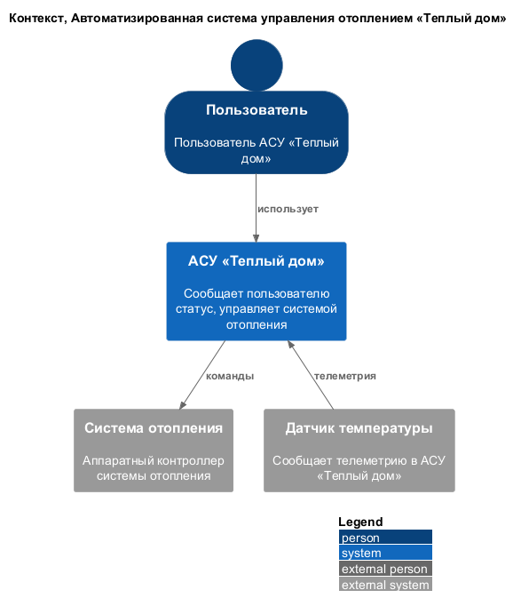
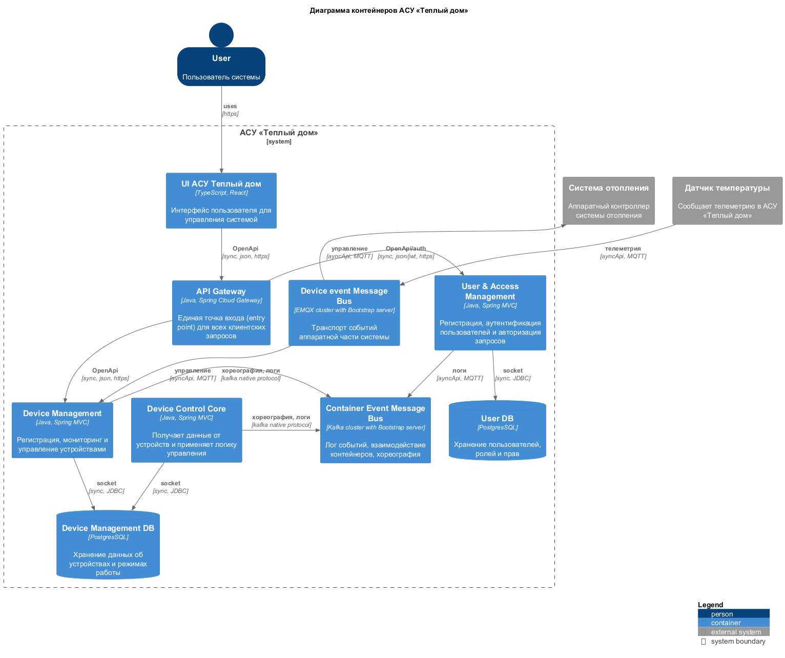
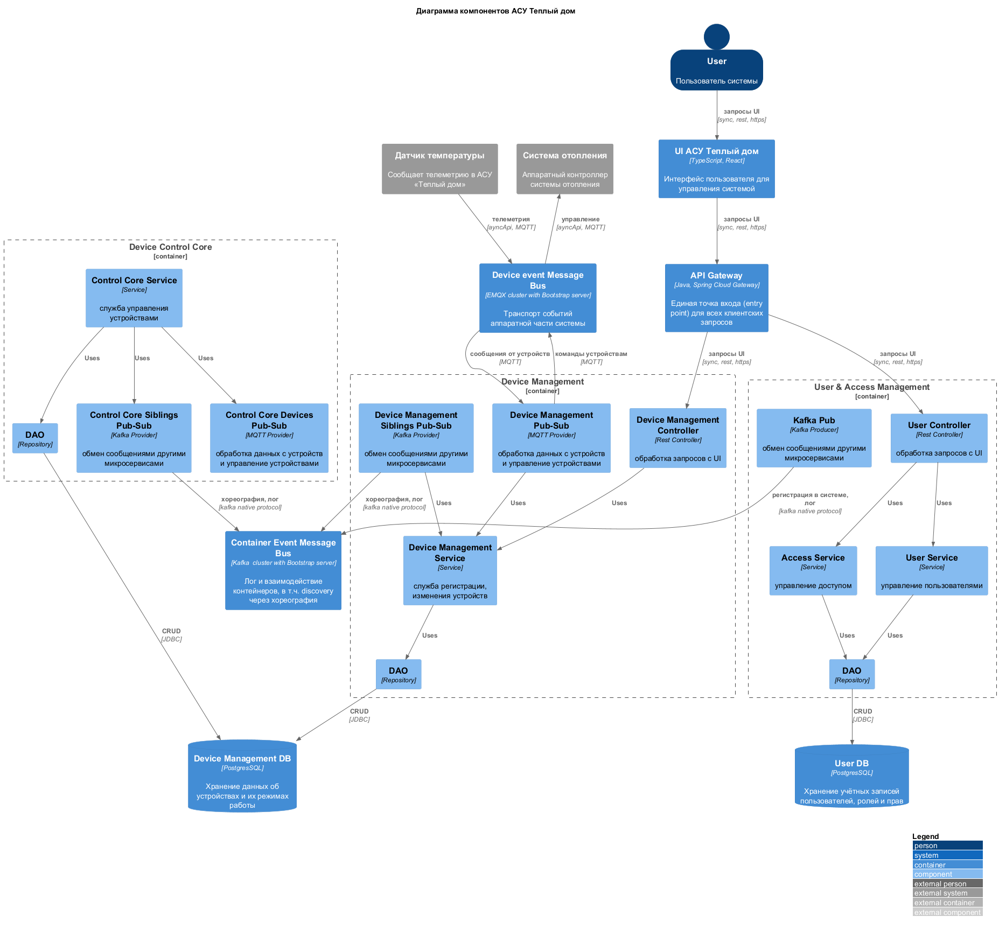
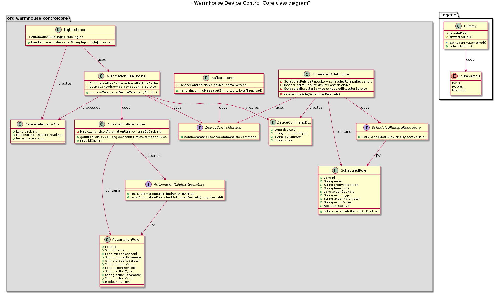
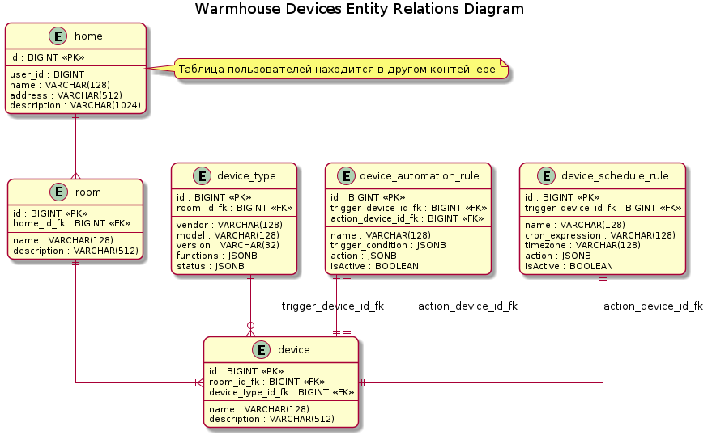

# Проект warmhouse
>Project_template
Это шаблон для решения проектной работы. Структура этого файла повторяет структуру заданий. Заполняйте его по мере работы над решением.

# Анализ и планирование
> Задание 1. Анализ и планирование

<aside>

Чтобы составить документ с описанием текущей архитектуры приложения, можно часть информации взять из описания компании и условия задания. Это нормально.

</aside>
## AS-IS
### Описание функциональности монолитного приложения
>1. Описание функциональности монолитного приложения

**Управление отоплением:**
- Пользователи могут управлять отоплением в доме
	1. удаленный ручной контроль системой отопления
	2. контроль системой отопления по таймеру
	3. автоматический контроль над системой управления на основе **система термостатического управления отоплением**
		* Доступно только если в систему интегрированы датчики температуры
- Система поддерживает интеграцию SOHO-системы отопления в приложение «Тёплый дом»
- Монтаж и настройка производится специалистом компании. Каждое решение уникально и требует уникального подхода. 

**Система термостатического управления отоплением**
- Доступно только если в систему интегрированы датчики температуры. 
- Пользователь может настроить логику работы термостата
	- Сервер всегда знает статус датчика температуры. На основе изменений статуса, может быть отправлена команда на изменение режима работы системы отопления в соответствии с пороговыми значениями, установленными пользователем.

**Контроль системы отопления по таймеру:**
* Система позволять задать до 50 слотов по установке режима работы отопления с привязкой по времени с точностью до минуты, с учетом дней недели.

**Мониторинг температуры:**
- Пользователи могут мониторить температуру в доме
- Система поддерживает 1 тип датчиков, сертифицированный компанией «Тёплый дом»
- Монтаж и настройка производится специалистом компании.
- Датчики через конфигурируемый интервал времени сообщают статус на сервер

**SLA:**
- В случае расщепления системы на изолированные сегменты, деградируют функции удаленного контроля, термостатического управления, управления по таймеру.
- Гарантия доступности сервера 85%
- Гарантия времени отклика системы 4 сек. 

### Анализ архитектуры монолитного приложения
>2. Анализ архитектуры монолитного приложения

Клиент-серверный монолит c синхронным взаимодействием. Среда выполнения клиента и сервера – Go. Данные хранятся удаленно, централизовано на сервере в СУБД Postgres.

### Домены и границы контекстов
> 3. Определение доменов и границы контекстов

#### Bounded Context АСУ «Теплый дом»
* Heating Control Core Domain
	*получает данные из различных источников (датчики, команды, расписания), применяет сложную бизнес-логику для разрешения потенциальных конфликтов и отдаёт финальную команду на исполнительное устройство*
	* Scheduled Heating Control Subdomain
		* Temporal Control Context
	* Thermostatic Control Subdomain
		* Thermostatic Control Context
	* User Control Subdomain
		* User Control Context
* **User & Access Management Domain**
  *Отвечает за учётные записи пользователей, роли и права. Имплементирует Role-Based Access Control*
	* Access Control Context
	* Authorization Control Context
	* User Registration Context
* **Device Management Domain**
  *Регистрация, отслеживание состояния и отправка команд на физические устройства (датчики, контроллеры котлов)*
	* Temperature Sensor Subdomain
	  *регистрация, управление и сбор телеметрии с датчиков*
		* Temperature Sensor Feeder Context
		* Temperature Sensor Management Context
	* Heater Controller Subdomain
		* Heater Controller Management Context
		  *регистрация, мониторинг и управление за контроллерами отопления*
		* Heater Controller Liveness Context
		  *поддержание актуального списка “живых” контроллеров отопления* 

### Проблемы монолитного решения
> 4. Проблемы монолитного решения

- «Бутиковые решения» имеют неконкурентную стоимость внедрения и поддержки
- Ограниченный потенциал масштабирования т.к. для монолита доступна только вертикальная модель масштабирования
- Высокая стоимость расширения спектра совместимых устройств
- Низкие гарантии доступности системы из-за зависимости от удаленного сервера синхронного взаимодействия
- Отсутствие возможности делигировать процессинг клиентской стороне 
### Контекст системы — диаграмма С4
> 5. Визуализация контекста системы — диаграмма С4
##### Диаграмма контекста АСУ «Теплый дом»

- [ER диаграмма устройств](diagrams/context/context-general.puml)
  

# Проект микросервисной архитектуры
> Задание 2. Проектирование микросервисной архитектуры

## To-Be

В этом задании вам нужно предоставить только диаграммы в модели C4. Мы не просим вас отдельно описывать получившиеся микросервисы и то, как вы определили взаимодействия между компонентами To-Be системы. Если вы правильно подготовите диаграммы C4, они и так это покажут.

**Диаграмма контейнеров (Containers)**

- [Диаграмма контейнеров](diagrams/container/containers-diagram-general.puml)
  

**Диаграмма компонентов (Components)**

 - [Общая диаграмма компонентов](diagrams/component/components-diagram-general.puml)
   

**Диаграмма кода (Code)**

- [Общая диаграмма компонентов](diagrams/code/device-control-core-class-diagram.puml)
  

# ER-диаграммы
> Задание 3. Разработка ER-диаграммы

- [ER диаграмма устройств](diagrams/er/device-erd.puml)
  

# Документирование API
> Задание 4. Создание и документирование API
### 1. Тип API

**UI-взаимодействие** построено в REST-стиле
 - Унифицированный интерфейс со встроенной поддержкой большинства платформ разработки
 - Отсутствие состояния делает стиль устойчивым к деградации канала связи
 - Возможность управлять кэшированием запросов для оптимизации нагрузки
 - Слоистая архитектура предоставляет возможность закрыть публичный доступ к внутренним микросервиса

**IOT-сообщения** передаются по MQTT
 - промышленный стандарт для IOT-систем, разработан для телеметрии
 - минимальный overhead для сенсоров и устройств
 - минимальный размер сообщения, 2 байта
 - управление гарантией доставки

**Межконтейнерное-взаимодейсвие** по Kafka native protocol
 - Pull-модель с хранением - оптимальное решение для построения хореографии между сервисами
 - Файловое хранение с ротацией подходит для логов
 - Низкие затраты на масштабирование канала с ростом роя микросервисов

### 2. Документация API

- [Взаимодействие между микросервисами](docs/kafka-asyncapi.yaml)
- [Сообщения телеметрии](docs/telemetry-asyncapi.yaml)
- [UI API](docs/ui-openapi.yaml)

# Задание 5. Работа с docker и docker-compose

Перейдите в apps.

Там находится приложение-монолит для работы с датчиками температуры. В README.md описано как запустить решение.

Вам нужно:

1) сделать простое приложение temperature-api на любом удобном для вас языке программирования, которое при запросе /temperature?location= будет отдавать рандомное значение температуры.

2) Приложение следует упаковать в Docker и добавить в docker-compose. Порт по умолчанию должен быть 8081

3) Кроме того для smart_home приложения требуется база данных - добавьте в docker-compose файл настройки для запуска postgres с указанием скрипта инициализации ./smart_home/init.sql
